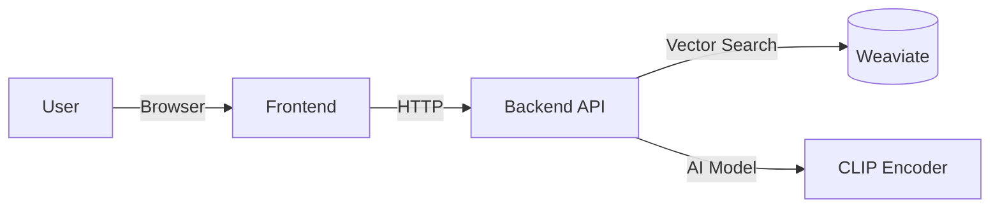

# Multi-Modal AI Search Engine

> A production-grade vector search engine that understands both **text** ("summer floral dress") and **images**. Powered by OpenAI's CLIP and Weaviate.

## Overview

Traditional search relies on keywords. This engine uses **semantic vector search** to find products based on meaning.

*   **Semantic Text Search**: Finds products matching the *concept* of your query.
*   **Visual Search**: Upload an image to find visually similar items.
*   **Hybrid Search**: Combines both for maximum accuracy.

---

## Quick Start (Recommended)

The easiest way to run the entire system (Database + API + UI) is with **Docker**.

### 1. Prerequisites
*   **Docker Desktop** (Installed & Running)
*   **Git**

### 2. Clone & Run
```bash
git clone https://github.com/yourusername/multi-modal-search-engine.git
cd multi-modal-search-engine

# Start everything
docker compose up --build
```

**Access the App:**
*   **Frontend UI**: [http://localhost:8501](http://localhost:8501)
*   **Backend API**: [http://localhost:8000](http://localhost:8000)

---

## Data Setup

The engine needs data to search! We use the **Fashion Product Images Dataset**.

1.  **Download Data**: [Kaggle Link](https://www.kaggle.com/datasets/paramaggarwal/fashion-product-images-small).
2.  **Organize Files**:
    ```
    multi-modal-search-engine/
    ├── data/
    │   └── fashion-dataset/
    │       ├── images/       <-- Put .jpg files here
    │       └── styles.csv    <-- Put CSV here
    ```
3.  **Ingest Data (One-Time Setup)**:
    The database starts empty. Run this script once to load the products:
    ```bash
    # Run the ingestion script inside the API container
    docker compose exec api python scripts/build_fashion_database.py
    ```
    *Why separate commands?*
    *   `docker compose up`: Starts the "engine" (Database, API, UI).
    *   `ingest script`: Fills the "tank" (loads data). You only do this once!

---

## Components & Architecture



*   **Frontend**: Streamlit (Port 8501)
*   **Backend**: FastAPI (Port 8000)
*   **Database**: Weaviate (Port 8080)

---

## Manual Setup (For Developers)

If you want to run components individually without Docker (e.g., for debugging):

1.  **Environment**:
    ```bash
    conda create -n multi-modal-search python=3.11 -y
    conda activate multi-modal-search
    ```
2.  **Install**: `pip install -r requirements.txt`
3.  **Database**: You still need Docker for Weaviate: `docker compose up weaviate -d`
4.  **Run API**: `uvicorn app.main:app --port 8000`
5.  **Run UI**: `streamlit run ui.py`

---

## License
MIT License.